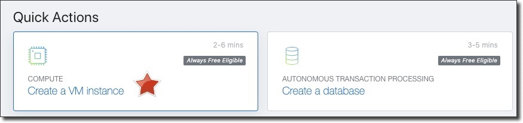
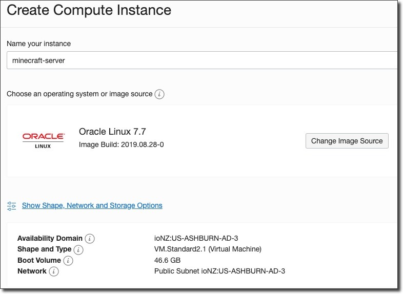
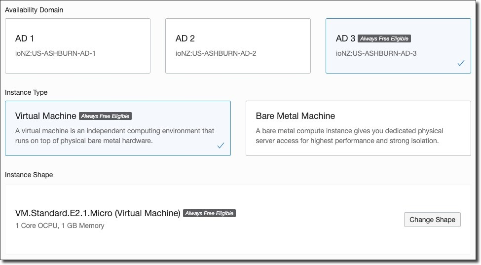
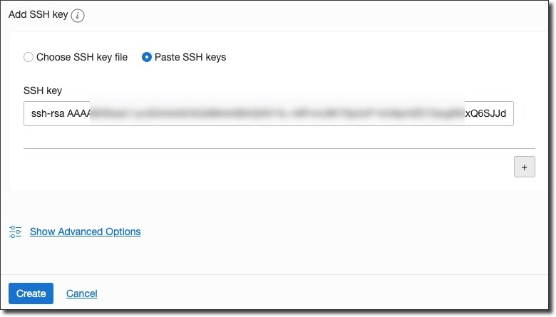
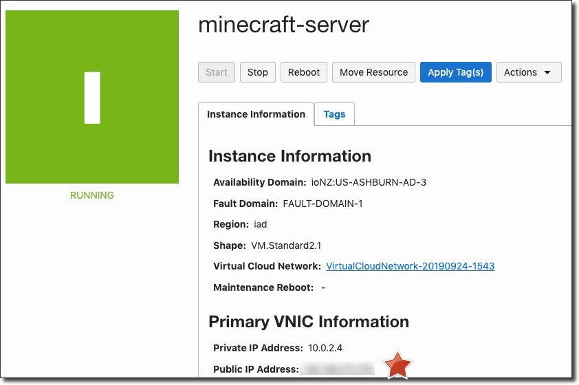
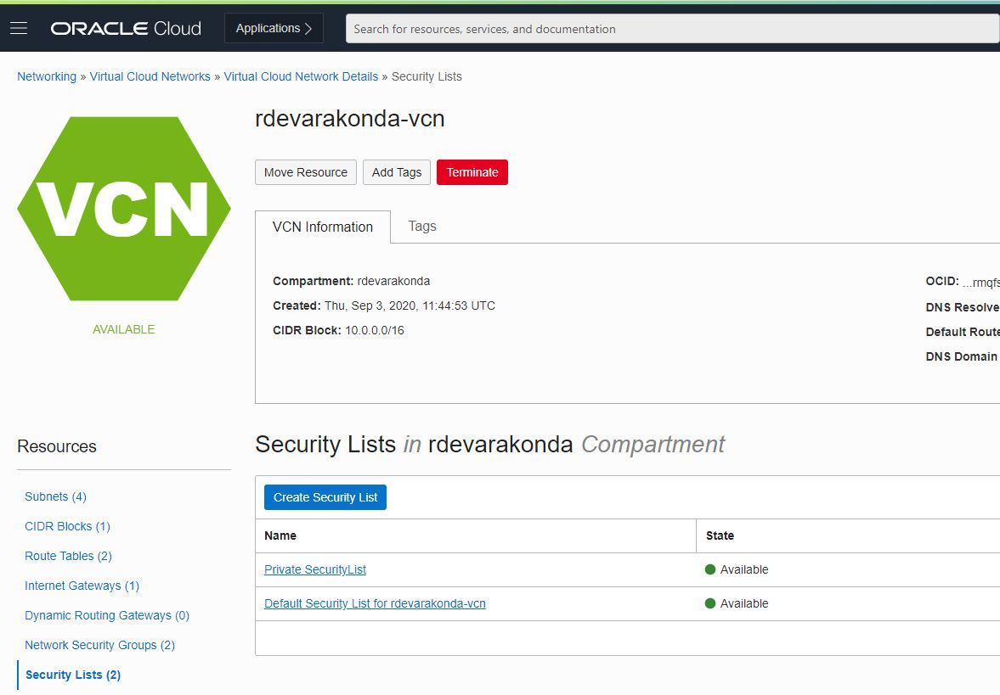
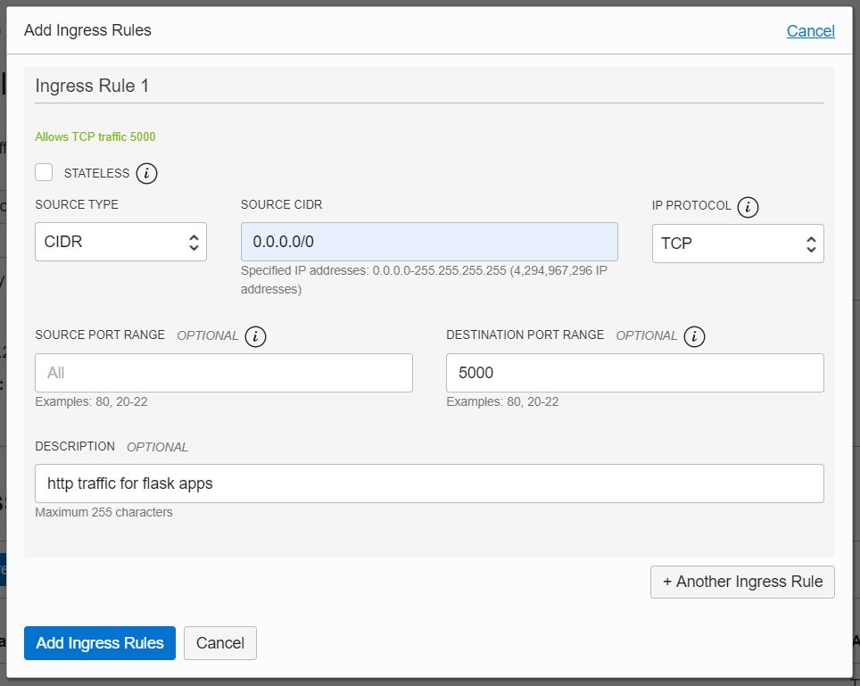
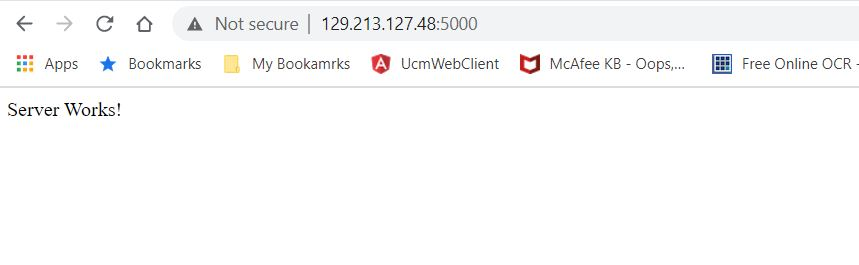
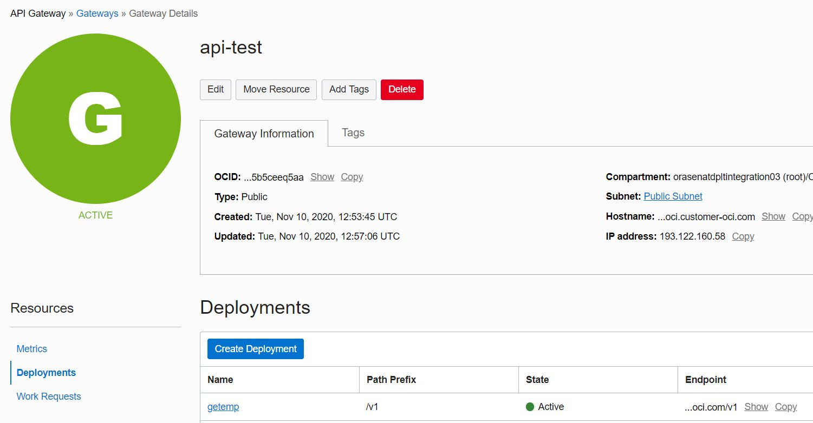
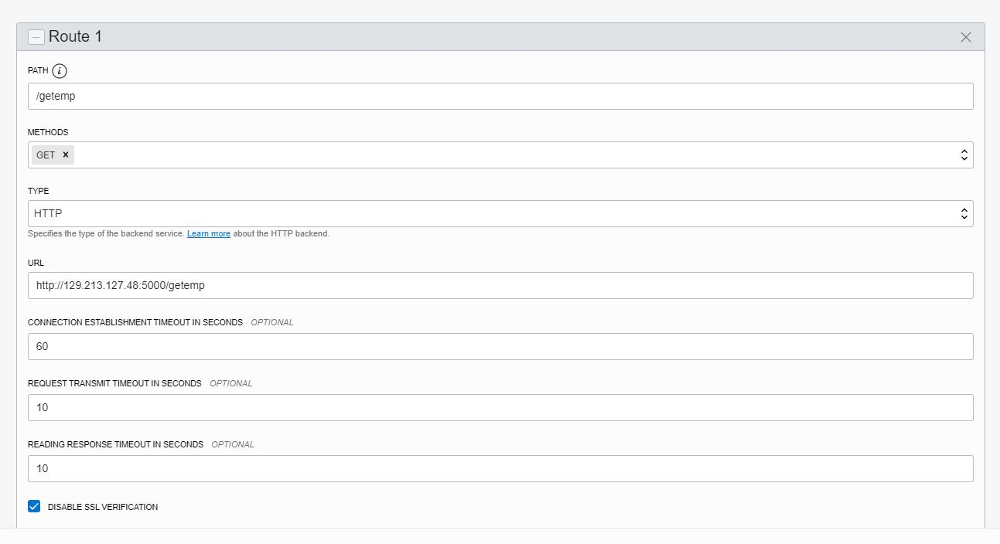

# creating http endpoint server to connect OCi API GW to Oracle Autonomous Database
## Create an "always free" virtual machine in OCI
We'll create an "always free" VM with Oracle Linux 7.x installed in it.
1. login to the OCI Console. In the Home page, under quick actions, click create Vm Instance
<br>
2. In the Create Compute instance page, enter a name for the VM
<br>
3. Click 'Show Shape, Network and Storage Options' and then make sure that you pick the 'Always Free' shape
<br>
4. we'll need an ssh keypair to login to the instance once it is provisioned. Generate an ssh keypair using [ssh-keygen](https://www.ssh.com/ssh/keygen/) on Linux or Macbook. Use Puttygen to generate the keypair if you are on WIndows
5. After the keypair is generated, save both private and public keys to a directory.
6. Open the public key with a text editor and copy the text. Back in the OCI Console, paste the copied text in to the box that says **Add SSH key**. Alternatively, you can select **choose SSH key file** and upload the public key file, by browsing to the directory where keys are saved.
<br>
7. Click create. It will take a couple of minutes for the instance to get provisioned.
8. Copy the public-ip address of the instance. 
<br>
9. connect to the instance to verify you can login successfully
   * Connect from a Linux/Mac Machine using the default cli tool like terminal using ssh command.
   <br>`ssh -i /path/to/private/key/file opc@public-ip`
   * Connect from Windows using a tool like putty.

## Configure the VM for http endpoint
1. make sure the virtual machine has latest python version installed using the command:
<br>`python3 --version`
1. install flask using pip:
<br> `sudo pip3 install flask`
1. If Git is not installed, install it using:<br> ` sudo yum install -y git`
1. clone this git repo using the command:
<br>`git clone https://github.com/ravi041282/oci-apigw-atp.git`
1. `cd` to the directory `oci-apigw-atp`
1. create a python venv by running the command:
<br> `python3 -m venv venv`
1. Navigate to the directory `./venv/bin/` and run: <br>`sh activate`
1. Navigate back to `oci-apigw-atp`. you should notice two files named `app.py` & `atpconnect.sh`
   1. `app.py` - has the code to publish various routes and one of them routes us to the atp connect script
   1. `atpconnect.sh` - the `app.py` script has a route to this script and this script connects to ATP to retrieve user details.
1. For now, we will leave the scripts as-is & test the flask connection.
1. Make sure you are in the directory `oci-apigw-atp` and run: <br>`flask run --host=0.0.0.0`

## Configure OCI Security list to allow traffic on port 5000
1. Flask applications run by default on port 5000. we'll need to open this port on the security list(firewall)
1. Back in the OCI Console navigate to Hamburger Menu > Networking > Virtual Cloud Networks
<br>
1. click on the VCN you have created and in the VCN page, click on Security Lists link under Resources
<br>
1. Click on the security list wihich starts with name **Default Security List**
1. Under Ingress Rules, click Add Ingress Rules button.
1. In the Add Ingress rules Window, enter `0.0.0.0/0` in the SOURCE CIDR box and enter `5000` in the DESTINATION PORT RANGE box and click Add Ingress Rules button to the bottom left.
<br>
1. open a new browser window and navigate to [http://public-ip.of.the.vm:5000](http://)
<br>

We have successfully configured the http endpoint.

## Configure the VM to connect to ATP
We will need to configure the VM to be able to connect to the ATP database. For this we will need Oracle SQL Client to be installed in the VM and we will need to upload the ATP Wallet to the VM. Press `Ctrl+c` from the Keyboard, if flask is still running in the foreground.
### Install sql client
run the following commands to install sql client:
```
sudo yum -y install oracle-release-el7
sudo yum -y install oracle-instantclient19.3-basic
```
### ATP Wallet
1. Back in the OCi Console, navigate to the ATP database that you created
1. click **DB Connection**
1. On the **Database Connection** page click Download
1. In the Download Wallet dialog, enter a wallet password in the Password field and confirm the password in the Confirm Password field. 
> Note: The password must be at least 8 characters long and must include at least 1 letter and either 1 numeric character or 1 special character.
5. Click Download to save the wallet zip file to a secure directory. rename the zip file to `wallet.zip`
6. Now, use a tool like scp on linux/Mac or winscp on Windows to upload this zip file to the VM. for example, on a linux/mac machine in the terminal run the command:<br>
`scp -i /path/to/private/key /path/to/wallet.zip opc@public-ip:~` 
7. Now, back in the VM, you should see the wallet zip file in the home directory. Unzip this file to the `$ORACLE_HOME/network/admin`. For example, in my env, running echo for oracle home gives:
```
[opc@instance-dmz admin]$ echo $ORACLE_HOME
/opt/oracle/instantclient_19_9
``` 
8. So, I unzipped wallet.zip to: <br>
`unzip -od /opt/oracle/instantclient_19_9/network/admin wallet.zip`

9. Navigate to `/opt/oracle/instantclient_19_9/network/admin` directory. Edit `sqlnet.ora` file and replace `(DIRECTORY="?/network/admin")` with full path of the unzipped wallet directory.<br>
i.e., to `(DIRECTORY="/opt/oracle/instantclient_19_9/network/admin")`. Save the file and exit out of the editor.

### Edit `atpconnect.sh`
Once sql client and wallet configuration is complete, we'll need to edit the `atpconnect.sh` script to edit select statement to reflect your ATP Table. Navigate back to `oci-apigw-atp` directory.
1. open `atpconnect.sh` using an editor like vim.
1. replace username and password from the line:<br>
```l_output=`sqlplus -s <username>/<password>@blkatp_low<<EOF```
1. change the sql_stmt to a select query on your table:<br>
```
sql_stmt := 'select * from employees where empname=''sid''';
```
4. run the script manually to verify it is working by running:<br> `sh atpconnect.sh`
5. Once script is verified, run flask as a background process by running:
<br> `flask run --host=0.0.0.0 >> flask-log.txt 2>&1 &`

ATP configuration is complete now. 
## Adding http endpoint to API Gateway
1. Back in OCI Console, navigate to hamburger menu > Developer Services > API Gateway
2. Click on the gateway that's created
3. In the Gateway screen, click on Deployments link under Resources and click on the deployment that was created
<br>
4. In the deployment details screen, copy and make a note of the apigw endpoint (visible to the right of the deploment) 
5. Now, click on the Edit button at the top of the screen
5. Click next on the Edit Deployment screen
6. Scroll down to the bottom of the page and click **+Another Route** button
7. In the PATH text box, enter `/getemp`
8. In the Methods box, click and choose GET
9. In the Type box, choose backend as HTTP
10. In the URL text box, enter `http://publi.ip.of.vm:5000/getemp`
<br> 
11. Click Next and Click Save Changes.
12. Now, you should be able to browse to the new route using the endpoint url. for example [https://apigwendpoint-url.com/getemp](https://apigwendpoint-url.com/getemp)
<br><br>
>**Disclaimer**: This is a personal repository. All code, views or opinions, and any other content represented here are personal and belong solely to me and do not represent those of people, institutions or organizations that I may or may not be associated with in professional or personal capacity, unless explicitly stated.<br>
<br>*Also **please note**, resources deployed using these example scripts do incur charges. Make sure to terminate the deployed resources/services after your tests, to save/minimize your bills*


